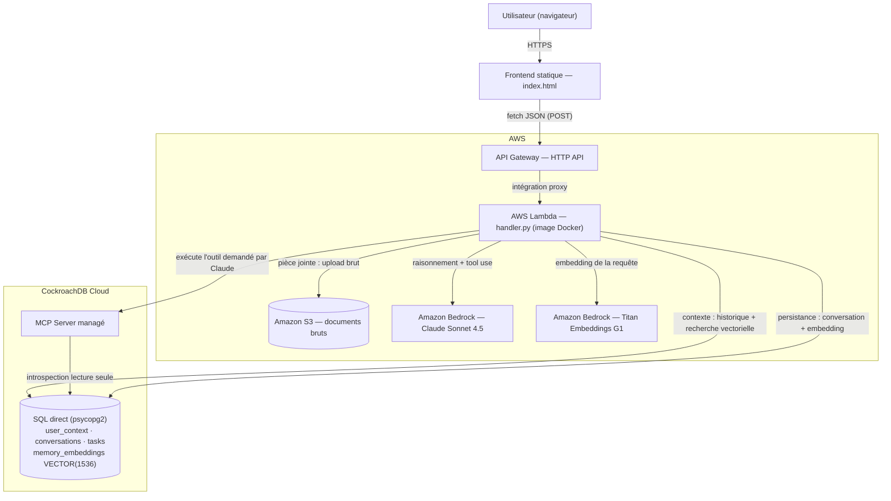

# Continuum — Agentic Memory powered by CockroachDB & AWS

> Un agent IA de production doté d'une mémoire persistante, distribuée et résiliente — construit pour le **CockroachDB × AWS Hackathon: Build with Agentic Memory**.

## 🎯 Le problème

Au Bénin comme dans une grande partie de l'Afrique francophone, la loi existe mais reste largement inaccessible au citoyen ordinaire : les textes sont publiés en PDF (souvent scannés, sans couche texte) dispersés sur des centaines de pages d'un site gouvernemental, sans recherche sémantique ni suivi d'une question dans le temps. Un citoyen qui a une question sur le droit du travail, une création d'entreprise ou un litige foncier doit soit consulter un juriste, soit fouiller manuellement des centaines de lois — et repart de zéro à chaque nouvelle question.

**Continuum** ingère la quasi-totalité des lois promulguées du Bénin recensées sur le site officiel (1518 textes sur 1619, soit ~94% — le reste correspond à des échecs persistants de téléchargement ou d'OCR sur des documents spécifiques, pas un pipeline en pause ; détail dans le statut ci-dessous), extraits via OCR — Amazon Textract — quand le PDF source est un scan sans texte, ce qui concerne la grande majorité du corpus, dans une base de connaissances vectorielle CockroachDB, et garde en mémoire persistante chaque échange avec l'utilisateur. Décris ta situation aujourd'hui, reviens dans un mois avec une question liée — l'agent retrouve à la fois ce que tu lui as déjà dit et peut citer le texte de loi exact qui s'applique. Précision importante : ce n'est **pas** un outil de conseil juridique — c'est une couche d'accès à l'information légale, à vérifier auprès d'un professionnel du droit pour toute décision. Conçu pour le Bénin, avec une architecture qui se généralise sans changement à d'autres pays (autre corpus de lois à ingérer, rien d'autre à modifier).

Ce projet utilise **CockroachDB** comme cerveau à long terme d'un agent IA déployé sur **AWS**, avec un raisonnement propulsé par **Amazon Bedrock**.

## 🏗️ Architecture



Deux canaux d'accès à CockroachDB, volontairement distincts :
- **SQL direct (psycopg2)** : écriture/lecture rapide de la mémoire, recherche vectorielle
- **MCP Server managé** : exposé comme un **outil que Claude appelle lui-même** pendant son raisonnement (introspection du schéma, requêtes de vérification en lecture seule)

Diagramme détaillé (dont le déroulé complet d'un tour de conversation, mémoire comprise) : [`docs/architecture.md`](./docs/architecture.md).

## 🧰 Stack technique

| Composant | Technologie |
|---|---|
| Base de données / mémoire agentique | **CockroachDB Cloud** (Serverless, free tier) |
| Recherche vectorielle / RAG | CockroachDB `VECTOR(1536)` + index distribué (`vector_l2_ops`) |
| Accès agent → base de données (autonome) | **CockroachDB Cloud Managed MCP Server** (tool use côté Claude) |
| Automatisation infra | **ccloud CLI** |
| Orchestration de l'agent | **AWS Lambda** (image Docker) exposée via **API Gateway** (HTTP API) |
| Modèle de langage | **Amazon Bedrock** — Claude Sonnet 4.5 (via inference profile) |
| Embeddings | **Amazon Titan Embeddings G1 - Text** (`amazon.titan-embed-text-v1`, 1536 dim) |
| Stockage de documents | **Amazon S3** |
| OCR (lois scannées) | **Amazon Textract** — la majorité des PDF de lois du Bénin sont des scans sans couche texte |
| Frontend | HTML/JS statique (`frontend/index.html`), sans dépendance de build |

Outils CockroachDB utilisés (minimum 2 requis par le hackathon) :
- ✅ **CockroachDB Cloud Managed MCP Server** — appelé en autonomie par Claude (tool use) pour l'introspection du schéma et les requêtes de vérification
- ✅ **Distributed Vector Indexing** — recherche par similarité sur `memory_embeddings` (mémoire personnelle + base de connaissances globale de 1518 lois du Bénin, sur 1619 recensées)
- ⬜ ccloud CLI *(utilisé, mais uniquement pour le provisioning humain du cluster en setup — `ccloud auth login` en local, aucun appel runtime depuis l'agent. Pas revendiqué comme un des outils du hackathon : ce n'est pas l'usage "agent-ready, accès direct au control plane" que la catégorie décrit.)*
- ⬜ Agent Skills Repo *(non utilisé)*

Service AWS utilisé (minimum 1 requis) :
- ✅ **Amazon Bedrock** — Claude (raisonnement + tool use) et Titan (embeddings)
- ✅ **AWS Lambda** — orchestration de l'agent, déployée en production (image Docker)
- ✅ **Amazon API Gateway** (HTTP API) — endpoint public devant la Lambda
- ✅ **Amazon S3** — stockage brut des documents et des lois avant ingestion
- ✅ **Amazon Textract** — OCR asynchrone sur les lois scannées (`agent/ingest_laws.py`)

## 📁 Structure du repo

```
.
├── agent/       # Logique de l'agent
│   ├── handler.py          # Point d'entrée Lambda + boucle agent (tool use MCP)
│   ├── bedrock_client.py   # Wrapper Bedrock : Claude + Titan Embeddings
│   ├── memory.py           # Accès CockroachDB (SQL direct + appel MCP Server)
│   ├── ingest.py            # Ingestion de documents PDF/texte (S3 → chunks → embeddings)
│   ├── test_phase3.py       # Test de recherche vectorielle sur documents
│   ├── test_discrimination.py  # Test multi-documents (classement par pertinence)
│   ├── sample_docs/         # Documents d'exemple pour les tests
│   ├── Dockerfile           # Image Lambda
│   ├── deploy.sh            # Script de déploiement (ECR + Lambda + Function URL)
│   ├── requirements.txt
│   └── .env.example
├── infra/       # Schéma SQL CockroachDB
│   └── schema.sql
├── frontend/    # Interface de chat
│   └── index.html
├── docs/        # Diagrammes d'architecture, notes de conception
└── README.md
```

## 🚀 Statut actuel

### ✅ Phase 0 — Setup
Cluster CockroachDB Cloud provisionné, MCP Server testé et validé.

### ✅ Phase 1 — Schéma de mémoire
Tables `user_context`, `conversations`, `tasks`, `memory_embeddings` (avec index vectoriel) et `sessions` (jetons d'authentification) créées. Schéma versionné dans [`infra/schema.sql`](./infra/schema.sql).

### ✅ Phase 2 — Cœur de l'agent
Lambda handler fonctionnel (testé en local puis déployé), intégration Bedrock (Claude + Titan), boucle "tool use" MCP validée, persistance de la mémoire conversationnelle validée sur 2 tours.

### ✅ Phase 3 — RAG + mémoire vectorielle
Ingestion de documents PDF et texte validée. Recherche vectorielle testée avec **discrimination multi-documents** (plusieurs documents sans rapport en mémoire, chaque question retrouve le bon document en tête du classement). Pipeline S3 → extraction → chunking → embedding → CockroachDB validé de bout en bout.

### ✅ Phase 3bis — Corpus de lois du Bénin (base de connaissances globale)
Scraping + ingestion réels exécutés contre [sgg.gouv.bj](https://sgg.gouv.bj/documentheque/lois/) (`agent/ingest_laws.py`), pas une preuve de concept sur un échantillon :
- **1518 lois ingérées sur 1619 recensées (~94%)**, 20 495 chunks indexés dans `memory_embeddings` (`source_type='law'`, `user_id NULL`).
- Bascule automatique **pypdf → OCR Amazon Textract** : la majorité des PDF sources sont des scans sans couche texte (vérifié via `pdffonts`/`pdfimages`, zéro police intégrée) ; pypdf est tenté en premier (rapide, gratuit), Textract prend le relais sinon.
- Les 101 lois manquantes se répartissent en deux catégories, pas un chiffre flou : **~83 doublons de numéro de loi dans le listing du site lui-même** (le même `law_number` apparaît deux fois — la seconde tentative échoue sur la contrainte d'unicité, sans perte réelle) et **18 échecs persistants et confirmés** (2 erreurs 502 du serveur gouvernemental sur les mêmes documents, 13 PDF qui se téléchargent vides à chaque tentative, 1 timeout Textract sur un très long texte) — retestés deux fois, mêmes échecs à chaque fois, traités comme définitifs plutôt que retentés indéfiniment.

### ✅ Phase 4 — Déploiement production
- Image Docker buildée et poussée sur **Amazon ECR**
- Fonction **AWS Lambda** créée (image container, 512 MB, timeout 60s), rôle IAM dédié (`AWSLambdaBasicExecutionRole`, `AmazonBedrockFullAccess`, `AmazonS3FullAccess`)
- Endpoint public : **API Gateway HTTP API** (`https://cuii8r8ija.execute-api.us-east-1.amazonaws.com`), intégration proxy avec la Lambda, CORS activé
- Frontend de chat fonctionnel (`frontend/index.html`), branché sur l'URL API Gateway
- Test bout en bout réussi : l'agent répond, se souvient d'une conversation antérieure, tool-use MCP observé en autonomie

⚠️ **Pourquoi API Gateway et pas une Lambda Function URL** : la Function URL retournait systématiquement `403 Forbidden` malgré une resource policy correcte (`lambda:InvokeFunctionUrl`, `AuthType=NONE`) — cause probablement liée à une restriction spécifique au compte AWS utilisé, non résolue avec certitude. API Gateway HTTP API fonctionne sans ce problème et est l'endpoint à utiliser.

⚠️ **Note pour qui relance `deploy.sh`** : le script provisionne encore une Function URL (legacy, étape 6) — l'API Gateway actuelle a été créée à la main via AWS CLI et n'est pas encore automatisée dans le script. Deux points d'attention si tu la recrées :
- `SourceArn` de la permission Lambda : `arn:aws:execute-api:{region}:{account}:{api-id}/*` (un seul wildcard — le format à 3 wildcards habituel en REST API v1 échoue silencieusement en HTTP API v2)
- Le certificat CA CockroachDB (`agent/cc-ca.crt`) doit être copié dans l'image Docker et référencé via `sslrootcert=/var/task/cc-ca.crt` dans `DATABASE_URL` — l'image `public.ecr.aws/lambda/python:3.12` n'a pas de magasin de certificats système complet, donc `sslrootcert=system` échoue

## 🔒 Sécurité et Product Readiness

Choix assumés, pas des oublis :

- **Authentification par compte + mot de passe**, gérée entièrement dans CockroachDB (pas de dépendance externe type Cognito) : mots de passe hachés avec `bcrypt` (jamais stockés en clair), jetons de session opaques (table `sessions`, expiration 7 jours) exigés sur les routes chat/upload/historique — plus de champ "nom" en clair sans vérification. Compromis assumé : le jeton est conservé en `localStorage` côté client (persistant entre rechargements), donc vulnérable en cas de XSS — acceptable pour une démo publique sans données sensibles réelles.
- **Throttling actif sur API Gateway** (`ai-employee-api`, stage `$default`) : 5 requêtes/s en continu, rafale de 10 (`ThrottlingRateLimit` / `ThrottlingBurstLimit`). L'API étant publique et sans clé, ça protège contre l'abus de coût (chaque message déclenche des appels Bedrock facturés) sans gêner un usage normal — testé avec une rafale de 20 requêtes simultanées, une partie rejetée (`503`) et le reste servi normalement.
- **CORS ouvert à `*`** volontairement, pour que le frontend statique (hébergé n'importe où) puisse appeler l'API sans configuration — acceptable pour une démo publique sans données sensibles réelles, à restreindre à l'origine exacte du frontend dans un contexte de production.
- **Documents uploadés** : extensions limitées (`.pdf`, `.txt`, `.md`), taille plafonnée à 4 Mo, nombre de chunks indexés plafonné (24 avec message, 40 en upload seul) pour rester sous le timeout fixe de 30s d'API Gateway — détaillé dans `agent/handler.py`.

## 🔧 Installation et lancement

### Pré-requis
- Un compte [CockroachDB Cloud](https://cockroachlabs.cloud) (gratuit, sans CB)
- Un compte AWS avec accès à Bedrock activé pour Claude et Titan Embeddings (Console AWS → Bedrock → Model access)
- `ccloud` CLI installé ([instructions](https://www.cockroachlabs.com/docs/cockroachcloud/ccloud-get-started))
- AWS CLI v2 récent, Docker, Python 3.11+

### 1. Cloner le repo
```bash
git clone https://github.com/<ton-user>/<ton-repo>.git
cd <ton-repo>
```

### 2. Configurer la base de données
```bash
ccloud auth login
export DATABASE_URL="postgresql://<user>:<password>@<host>:26257/defaultdb?sslmode=verify-full"
cockroach sql --url "$DATABASE_URL" < infra/schema.sql
```

### 3. Configurer l'environnement de l'agent
```bash
cd agent
pip install -r requirements.txt
cp .env.example .env
# Éditer .env avec tes vraies valeurs
```

⚠️ **Modèle Bedrock** : les modèles Claude récents (Sonnet 4.5+) nécessitent un **inference profile**, préfixé par région :
```
BEDROCK_CLAUDE_MODEL_ID=us.anthropic.claude-sonnet-4-5-20250929-v1:0
```

### 4. Tester l'agent en local
```bash
python -m dotenv run python handler.py
```

### 5. Tester l'ingestion de documents
```bash
python -m dotenv run python test_discrimination.py [chemin/vers/un.pdf optionnel]
```

### 6. Déployer sur AWS Lambda
```bash
chmod +x deploy.sh
./deploy.sh
```
Le script build et pousse l'image, puis crée/met à jour la fonction Lambda (il provisionne aussi une Function URL, non utilisée en production — voir note Phase 4 ci-dessus). Il faut ensuite exposer la Lambda via une **API Gateway HTTP API** (intégration proxy, route `$default`, CORS activé) — c'est cette URL-là qu'il faut utiliser en pratique. Teste-la avec :
```bash
# 1. Créer un compte (retourne un session_token)
curl -X POST <URL_API_GATEWAY> \
  -H 'Content-Type: application/json' \
  -d '{"action":"signup","name":"stanley","password":"un_mot_de_passe_solide"}'

# 2. Discuter avec le jeton obtenu
curl -X POST <URL_API_GATEWAY> \
  -H 'Content-Type: application/json' \
  -d '{"session_token":"<TOKEN_REÇU>","message":"Salut !"}'
```

### 7. Lancer le frontend
Ouvre simplement `frontend/index.html` dans un navigateur, colle l'URL API Gateway dans le champ prévu, et discute avec l'agent.

## 🎥 Démo

- Lien démo fonctionnelle : [honkpehedji-stanley.github.io/CockroachDB-AWS-Hackathon](https://honkpehedji-stanley.github.io/CockroachDB-AWS-Hackathon/)
- Vidéo de présentation (< 3 min) : *à venir*

## 📜 Licence

Ce projet est distribué sous licence **GNU General Public License v3.0** — voir [`LICENSE`](./LICENSE).

## 🙌 Hackathon

Projet développé dans le cadre du [CockroachDB × AWS Hackathon — Build with Agentic Memory](https://cockroachdb-ai.devpost.com/).