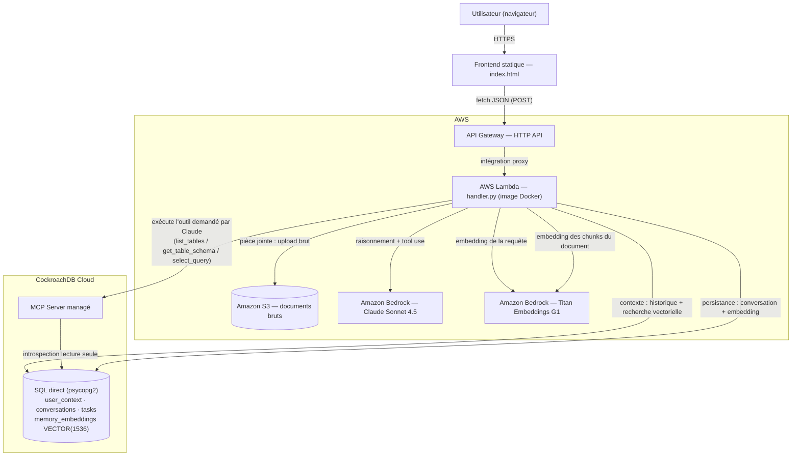
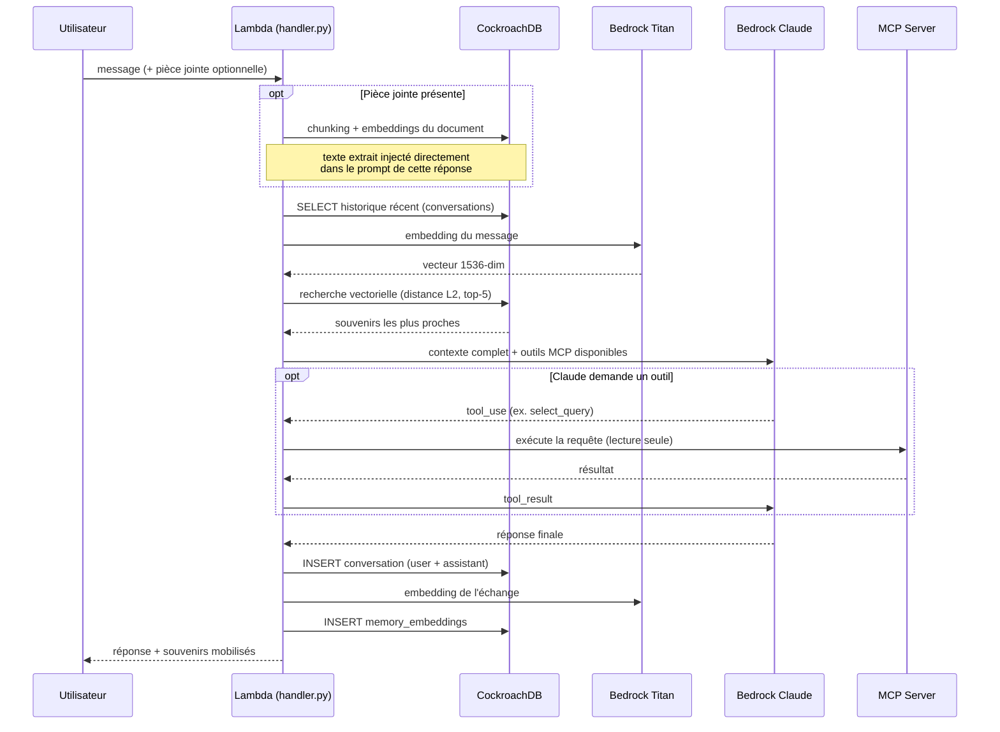

# Architecture — AI Employee

Deux diagrammes : la vue d'ensemble des composants, puis le déroulé détaillé
d'un tour de conversation (c'est là que la mémoire agentique CockroachDB
intervient concrètement).

## Vue d'ensemble

Deux canaux d'accès à CockroachDB, volontairement distincts :
- **SQL direct (psycopg2)** — écriture/lecture rapide de la mémoire structurée, recherche vectorielle (`vector_l2_ops`).
- **MCP Server managé** — exposé comme un outil que Claude peut décider d'appeler lui-même pendant son raisonnement (introspection du schéma, requêtes de vérification en lecture seule). C'est le modèle qui décide *si* et *quand* s'en servir ; la Lambda exécute l'appel HTTP en son nom et lui renvoie le résultat.

## Déroulé d'un tour de conversation

Ce que fait concrètement l'agent entre la question de l'utilisateur et sa
réponse — la mémoire n'est pas un détail d'implémentation, c'est ce qui
détermine le contenu de la réponse.

Les "souvenirs mobilisés" (contenu, source, distance) sont renvoyés au
frontend et affichés dans le panneau "Mémoire mobilisée" — la recherche
vectorielle est visible pour l'utilisateur, pas juste un détail interne.
